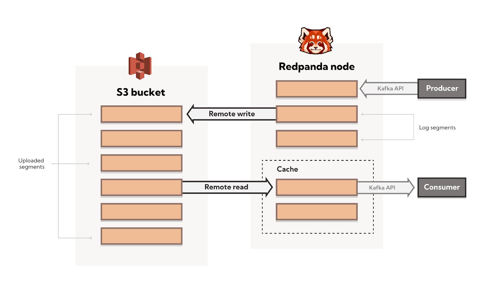

## Shadow Indexing example


Shadow indexing includes multiple features to make your distributed streaming system more resilient and affordable. Some of the currently-available features are:
- tiered storage
- topic recovery
- read replicas
- infinite data retention

This example walks through installing a local S3-compatible object storage and Redpanda with shadow indexing enabled via the helm chart. These instructions assume you have completed the pre-requisite steps [here](../../README.md#prerequisites), and have a kubernetes cluster configured with cert-manager installed.

## Object storage

Shadow indexing requires and S3-compatible storage service, and there are multiple to choose from depending on your target environment (local, AWS, GCP, Azure, etc.). A local deployment is more complicated than using a cloud provider because you also need to deploy your own S3-compatible service.

The following steps will walk through deploying [MinIO](https://min.io) for object storage within a local kubernetes cluster. If you are deploying Redpanda to a cloud provider where you already have object storage, then you can skip to [this section](#redpanda).

### Install

There are two steps storage-related installs: the MinIO CLI and the helm deployment.

Install the CLI on your local system:

For MacOS:

```sh
brew install minio/stable/mc
```

For Linux:

```sh
mkdir ~/bin 2> /dev/null; cd ~/bin
curl -O https://dl.min.io/client/mc/release/linux-amd64/mc
chmod +x mc
```

If needed, add `~/bin` to PATH in `~/.bashrc` or `~/.zshrc`:
```sh
export PATH=$PATH:$HOME/bin
```

The [minio.yaml](./minio.yaml) file contains the namespace `shadow-indexing`, a ClusterIP service `minio`, and a deployment `minio`:

```sh
> cd helm-charts
> kubectl create -f examples/with-shadow-indexing/minio.yaml
namespace/shadow-indexing created
service/minio created
deployment.apps/minio created
```

### Verification

Check that the MinIO deployment, service and related objects are in the desired state (the pod should have status `Running`):

```sh
> kubectl get all -A -o wide --field-selector=metadata.namespace=shadow-indexing
```

> Add `watch` before the above command and run it in a separate terminal to easily monitor results of the following commands.

### Post-install

The MinIO service exposes port 9000 to the cluster, and kubectl can forward that port to the local system for Minio CLI access:

```sh
> kubectl -n shadow-indexing port-forward svc/minio 9000 &> /dev/null &
[1] 455430
```

MinIO can connect to many S3-compatible services, so each connection must be registered with an alias. In this case we use the alias `local`. This is similar to the concept of regions in cloud-based storage providers.

```sh
> mc alias set local http://localhost:9000 minio minio123 --api s3v4
Added `local` successfully.
```

Next, use the MinIO CLI to create the `redpanda` bucket within the local region:

```sh
> mc mb local/redpanda
Bucket created successfully `local/redpanda`.
```

Watch this bucket in a new terminal to see when files are uploaded:

```sh
> watch mc ls -r local
```

## Redpanda

Now we have a storage bucket and we can start up Redpanda with shadow indexing. 

### Install

The helm chart does not enable shadow indexing by default, since there is no way to know which storage service each user prefers. This feature can be enabled in three ways:
1. Passing arguments to the helm command
2. Modifying the `values.yaml` file
3. Passing an additional values file to the command

These instructions take the third approach, and the file containing all non-default shadow-indexing configuration is [here](./values_add_si.yaml). Search for `cloud_storage_` in [values.yaml](../../redpanda/values.yaml) for descriptions and default values for all properties.

> Note: `values_add_si.yaml` contains values that will connect to the MinIO object storage setup in the prior section. If you are connecting to another object storage system, you should edit this with proper connection details for your environment.

Once you have verified the values in the `values_add_si.yaml` file, run the following command to install Redpanda:

```sh
> helm install redpanda redpanda -n shadow-indexing -f examples/with-shadow-indexing/values_add_si.yaml
```

### Verification

After a moment you will see three Redpanda pods in `Running` status. Follow the logs of the main container within the first pod from a new terminal to ensure there are no errors:

```sh
> kubectl -n shadow-indexing logs -f redpanda-0
```

### Post-install

Now we can create a topic, which will also allow testing the shadow indexing features:

```sh
> kubectl exec -it -n shadow-indexing redpanda-0 -- rpk topic create thetopic -c retention.bytes=100000 -c segment.bytes=10000
Defaulted container "redpanda" out of: redpanda, redpanda-configurator (init)
TOPIC     STATUS
thetopic  OK
```

Go back to the terminal where you were watching the bucket contents and see that the topic manifest file has been uploaded:

```sh
[2022-05-15 22:34:17 EDT]   285B STANDARD redpanda/b0000000/meta/kafka/thelog/topic_manifest.json
```

Start sending events to the topic, and over time more content representing the oldest offets will be uploaded to the bucket as data in the topic reaches the retentions size limit. The following command produces 1000 events at a time. Run this command several times and watch the bucket contents grow:

```sh
> BATCH=$(date) ; printf "$BATCH %s\n" {1..1000} | kubectl exec -it -n shadow-indexing redpanda-0 -- rpk topic produce thetopic
```

## Next steps

If you are done with your cluster, follow the cleanup steps [here](../../README.md#cleanup).

See [this page](https://docs.redpanda.com/docs/data-management/tiered-storage/) to learn more about tiered storage and other features of shadow indexing.

Also watch our [blog](https://redpanda.com/blog) to get updates on all things Redpanda is doing, and [join our slack community](https://join.slack.com/t/redpandacommunity/shared_invite/zt-ng2ze1uv-l5VMWSGQHB9gp47~kNnYGA/) to meet other people building with Redpanda and to get help with building your own streaming application.
